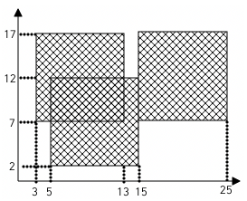
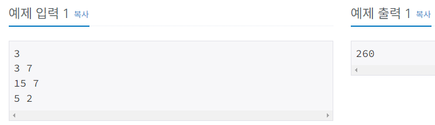

# Silver-5 2563번

### 문제
<p>가로, 세로의 크기가 각각 100인 정사각형 모양의 흰색 도화지가 있다. 이 도화지 위에 가로, 세로의 크기가 각각 10인 정사각형 모양의 검은색 색종이를 색종이의 변과 도화지의 변이 평행하도록 붙인다. 이러한 방식으로 색종이를 한 장 또는 여러 장 붙인 후 색종이가 붙은 검은 영역의 넓이를 구하는 프로그램을 작성하시오.



예를 들어 흰색 도화지 위에 세 장의 검은색 색종이를 그림과 같은 모양으로 붙였다면 검은색 영역의 넓이는 260이 된다.</p>

### 입력
<p>첫째 줄에 색종이의 수가 주어진다. 이어 둘째 줄부터 한 줄에 하나씩 색종이를 붙인 위치가 주어진다. 색종이를 붙인 위치는 두 개의 자연수로 주어지는데 첫 번째 자연수는 색종이의 왼쪽 변과 도화지의 왼쪽 변 사이의 거리이고, 두 번째 자연수는 색종이의 아래쪽 변과 도화지의 아래쪽 변 사이의 거리이다. 색종이의 수는 100 이하이며, 색종이가 도화지 밖으로 나가는 경우는 없다</p>

### 출력
<p>첫째 줄에 색종이가 붙은 검은 영역의 넓이를 출력한다.</p>

### 예제


### 내 풀이
```python
import sys
input = sys.stdin.readline

N = int(input())
area = [[0 for j in range(100)] for i in range(100)]   #0으로 2차원 배열 초기화. 리스트 컴프리헨션 사용

for i in range(N):
    x, y = map(int, input().split())    #좌표를 입력받는다.
    for X in range(x, x+10):            
        for Y in range(y, y+10):
            if area[X][Y] == 0:         #좌표+10으로 정사각형 검은색 영역을 1로 표현한다.
                area[X][Y] = 1

count = sum(element == 1 for row in area for element in row) #2차원 배열에서 1의 갯수를 센다. 리스트 컴프리헨션 사용

print(count)
```

처음에 문제를 봤을때는 어떻게 풀어야할지 막막했다. 몇일동안 고민하다가 문제 힌트를 살짝 찾아본 결과, 2차원 배열을 사용하면 쉽게 풀린다는 것을 알게 되었다.

내가 생각한 방법은 2차원 배열을 0으로 초기화 해놓고, 좌표 x,y를 입력받으면, (x,y) 부터 (x+10,y+10)까지에 해당하는 인덱스의 값을 1로 변화시킨다. 이를 반복하면 2차원 배열인 도화지 속에, 1로 표현된 검은색 영역을 구현할 수 있다.
마지막에는 2차원 배열 안에 1의 갯수만 세어보면 검은색 영역의 넓이를 구할 수 있다.

