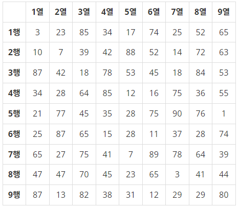
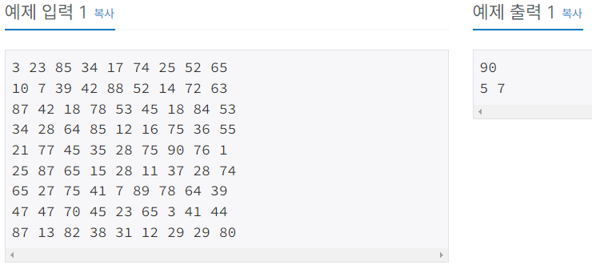
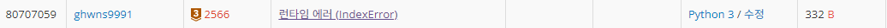
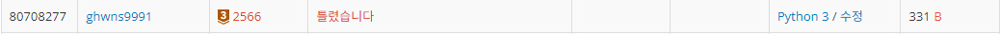
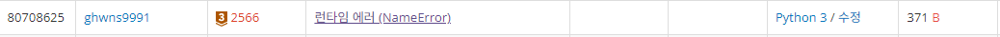
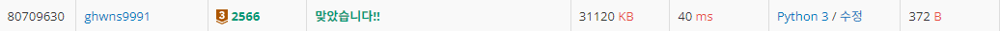
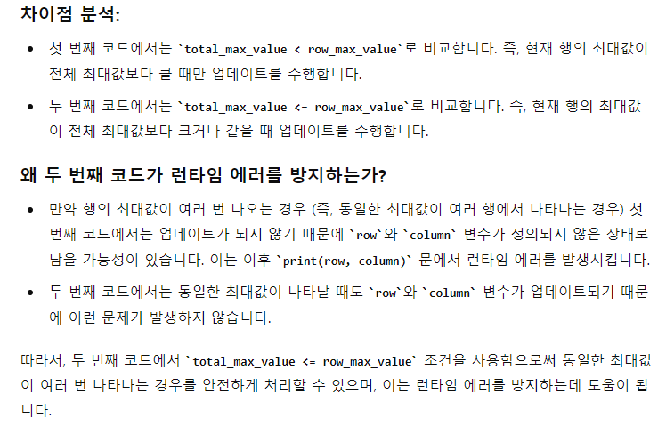

# Bronze-3 2566번

### 문제
<p><그림 1>과 같이 9×9 격자판에 쓰여진 81개의 자연수 또는 0이 주어질 때, 이들 중 최댓값을 찾고 그 최댓값이 몇 행 몇 열에 위치한 수인지 구하는 프로그램을 작성하시오.

예를 들어, 다음과 같이 81개의 수가 주어지면



이들 중 최댓값은 90이고, 이 값은 5행 7열에 위치한다.</p>

### 입력
<p>첫째 줄부터 아홉 번째 줄까지 한 줄에 아홉 개씩 수가 주어진다. 주어지는 수는 100보다 작은 자연수 또는 0이다.</p>

### 출력
<p>첫째 줄에 최댓값을 출력하고, 둘째 줄에 최댓값이 위치한 행 번호와 열 번호를 빈칸을 사이에 두고 차례로 출력한다. 최댓값이 두 개 이상인 경우 그 중 한 곳의 위치를 출력한다.</p>

### 예제


### 내 풀이
```python
import sys
input = sys.stdin.readline

cell = []

for i in range(9):
    cell.append(list(map(int, input().split())))

max_value = 0
x = 0
y = 0

for i in range(1, 10):
    for j in range(1, 10):
        if max_value < cell[i][j]:
            max_value = cell[i][j]
            x = i
            y = j

print(max_value)
print(x, y)
```

2차원 배열에서의 최대값을 찾기 위해서 max(cell) 이런식으로 사용했었는데, cell 리스트안에 있는 리스트 한 줄을 그대로 출력하였다. 그래서, 최대값을 찾는 알고리즘을 따로 작성해 주었고, 좌표값도 받아오게 하였다.



결과는 런타임 에러.
백준에서 런타임 에러는 다음과 같은 이유가 많다고 한다.

```plaintext
1.배열에 할당된 크기를 넘어서 접근했을 때
2.전역 배열의 크기가 메모리 제한을 초과할 때
3.지역 배열의 크기가 스택 크기 제한을 넘어갈 때
4.0으로 나눌 떄
5.라이브러리에서 예외를 발생시켰을 때
6.재귀 호출이 너무 깊어질 때
7.이미 해제된 메모리를 또 참조할 때
```

내가 보기엔, 1번 사항에 해당하는 오류인 것 같다. 내가 이미 0~8 인덱스로 cell이라는 배열을 만들어놓고서는, 최대값 비교를 할 때에는 1~9 인덱스로 호출하는 바보같은 짓을 했다!

### 수정
```python
import sys
input = sys.stdin.readline

cell = []

for i in range(9):
    cell.append(list(map(int, input().split())))

max_value = 0
x = 0
y = 0

for i in range(9):
    for j in range(9):
        if max_value < cell[i][j]:
            max_value = cell[i][j]
            x = i + 1
            y = j + 1

print(max_value)
print(x, y)
```

수정한 결과는 오답! 런타임 에러는 뜨지 않는 걸 보니, 위 문제는 해결한 것 같다!


이제 문제를 다시 풀어야 하는데...
문제 카테고리가 2차원 배열 이다 보니, 너무 2차원 배열을 만드는 데에 집착한 것 같다. 굳이 2차원 배열을 만들지 않고, 입력을 받는 순간에 최대값을 찾아내면 더 간단하게 풀 수 있지 않을까?

```python
import sys
input = sys.stdin.readline

total_max_value = 0
row_max_value = 0

for i in range(9):
    cell = list(map(int, input().split()))
    row_max_value = max(cell)
    if total_max_value < row_max_value:
            total_max_value = row_max_value
            row = i + 1
            column = cell.index(row_max_value) + 1

print(total_max_value)
print(row, column)
```
결과는 다시 런타임 에러...


이번엔 잘못한거 없는 것 같은데 무슨 문제이지.. 하다가 혹시나 하는 마음에 if문의 조건을 < 에서 <= 으로 바꾸어 보았다.

```python
import sys
input = sys.stdin.readline

total_max_value = 0
row_max_value = 0

for i in range(9):
    cell = list(map(int, input().split()))
    row_max_value = max(cell)
    if total_max_value <= row_max_value:
            total_max_value = row_max_value
            row = i + 1
            column = cell.index(row_max_value) + 1

print(total_max_value)
print(row, column)
```

결과는 런타임 에러 없이 정답.


도대체 저 하나의 차이가 무슨 차이일까 싶어서 ChatGPT에게 물어보았다.


동일한 최대값이 여러 행에서 나타나는 경우에, 첫 번째 코드에서는 업데이트가 안되므로, row와 column이 정의되지 않은 상태로 남을 수 있다는 것인데.. 흠 아직까진 잘 이해가 되지는 않는다.
