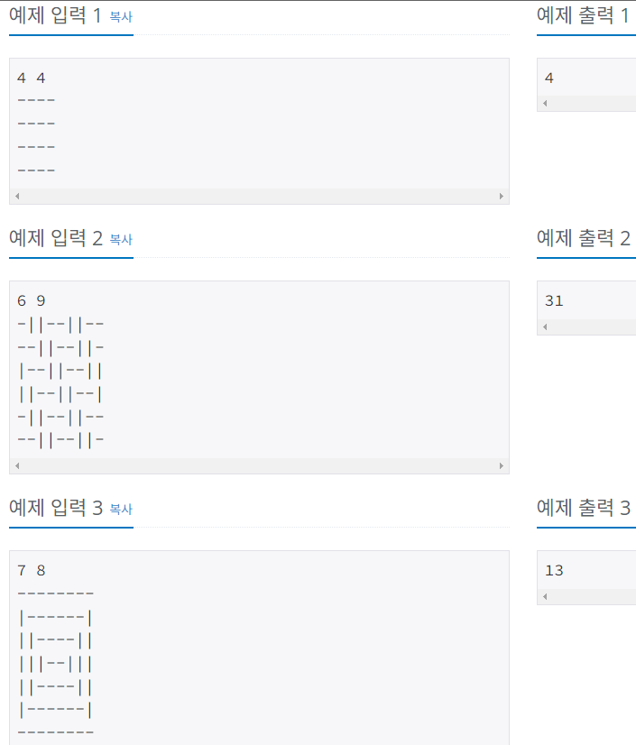
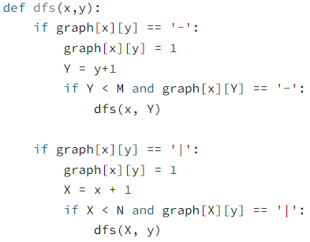
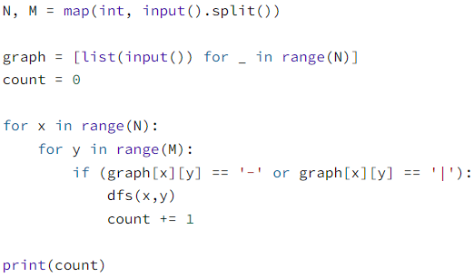
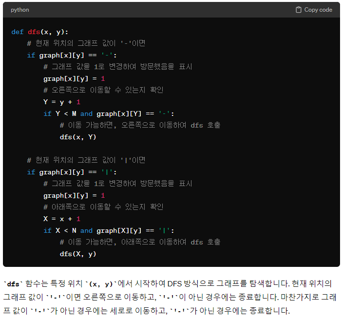
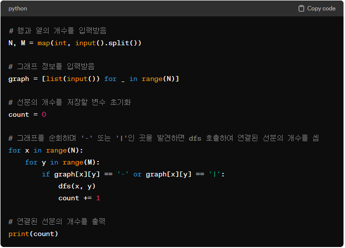

# Silver-4 1388번

### 문제
<p>형택이는 건축가이다. 지금 막 형택이는 형택이의 남자 친구 기훈이의 집을 막 완성시켰다. 형택이는 기훈이 방의 바닥 장식을 디자인했고, 이제 몇 개의 나무 판자가 필요한지 궁금해졌다. 나무 판자는 크기 1의 너비를 가졌고, 양수의 길이를 가지고 있다. 기훈이 방은 직사각형 모양이고, 방 안에는 벽과 평행한 모양의 정사각형으로 나누어져 있다.</p>

<p>이제 ‘-’와 ‘|’로 이루어진 바닥 장식 모양이 주어진다. 만약 두 개의 ‘-’가 인접해 있고, 같은 행에 있다면, 두 개는 같은 나무 판자이고, 두 개의 ‘|’가 인접해 있고, 같은 열에 있다면, 두 개는 같은 나무 판자이다.</p>

<p>기훈이의 방 바닥을 장식하는데 필요한 나무 판자의 개수를 출력하는 프로그램을 작성하시오.</p>

### 입력
<p>첫째 줄에 방 바닥의 세로 크기N과 가로 크기 M이 주어진다. 둘째 줄부터 N개의 줄에 M개의 문자가 주어진다. 이것은 바닥 장식 모양이고, '-‘와 ’|‘로만 이루어져 있다. N과 M은 50 이하인 자연수이다.</p>

### 출력
<p>첫째 줄에 문제의 정답을 출력한다.</p>

### 예제


### 내 풀이
```python
import sys
input = sys.stdin.readline

N, M = map(int, input().split())

floor = []
for _ in range(N):
    floor.append(input().strip())

count = 0

for i in range(N):
    w_visited = False
    for j in range(M):
        if floor[i][j] == '-' and w_visited == False:
            w_visited = True
            count += 1
        elif floor[i][j] == '|':
            w_visited = False

for i in range(M):
    l_visited = False
    for j in range(N):
        if floor[j][i] == '|' and l_visited == False:
            l_visited = True
            count += 1
        elif floor[j][i] == '-':
            l_visited = False

print(count)
```

DFS를 사용해야겠다는 생각은 했지만, 어떻게 써야할지를 잘 모르겠어서...
'-' 판자를 세는 경우와 '|'판자를 세는 경우를 따로 해서 작성했다.

### 다른 사람 풀이
```python
def dfs(x,y):
    if graph[x][y] == '-':
        graph[x][y] = 1
        Y = y+1
        if Y < M and graph[x][Y] == '-':
            dfs(x, Y)

    if graph[x][y] == '|':
        graph[x][y] = 1
        X = x + 1
        if X < N and graph[X][y] == '|':
            dfs(X, y)
        
N, M = map(int, input().split())

graph = [list(input()) for _ in range(N)]
count = 0

for x in range(N):
    for y in range(M):
        if (graph[x][y] == '-' or graph[x][y] == '|'):
            dfs(x,y)
            count += 1
        
print(count)
```
DFS 함수를 따로 구현해서 사용한 모습을 볼 수 있다.



내 풀이와 마찬가지로 '-'일 때와, '|'일 때 따로 처리해주었는데, 

현재 위치가 '-'일 때는 일단 값을 1로 변경하여 방문했음을 표시하고, 다음 열에도 '-'가 존재하는지 검사하고, 존재한다면 변경된 Y 값으로 dfs함수를 재귀호출 해주었다.

현재 위치가 '|'일 때도 마찬가지로, 일단 값을 1로 변경하여 방문했음을 표시하고, 다음 행에도 '|'가 존재하는지 검사하고, 존재한다면 변경된 X 값으로 dfs함수를 재귀호출 해주었다.



이제 메인에서 dfs 함수를 호출해서, 다음 판자가 서로 다른 판자이면 재귀호출을 하지 않으므로, count를 1 증가 시킨다. 또 다시 그래프를 순회하며 값이 1로 바뀌지 않아서 아직 방문하지 않은 '-', '|'을 찾게 되면, dfs 함수를 호출하게 된다.

### ChatGPT 풀이


