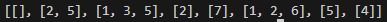

# Silver-3 2606번

### 문제
<p>신종 바이러스인 웜 바이러스는 네트워크를 통해 전파된다. 한 컴퓨터가 웜 바이러스에 걸리면 그 컴퓨터와 네트워크 상에서 연결되어 있는 모든 컴퓨터는 웜 바이러스에 걸리게 된다.

예를 들어 7대의 컴퓨터가 <그림 1>과 같이 네트워크 상에서 연결되어 있다고 하자. 1번 컴퓨터가 웜 바이러스에 걸리면 웜 바이러스는 2번과 5번 컴퓨터를 거쳐 3번과 6번 컴퓨터까지 전파되어 2, 3, 5, 6 네 대의 컴퓨터는 웜 바이러스에 걸리게 된다. 하지만 4번과 7번 컴퓨터는 1번 컴퓨터와 네트워크상에서 연결되어 있지 않기 때문에 영향을 받지 않는다.</p>


<p>어느 날 1번 컴퓨터가 웜 바이러스에 걸렸다. 컴퓨터의 수와 네트워크 상에서 서로 연결되어 있는 정보가 주어질 때, 1번 컴퓨터를 통해 웜 바이러스에 걸리게 되는 컴퓨터의 수를 출력하는 프로그램을 작성하시오.</p>

### 입력
<p>첫째 줄에는 컴퓨터의 수가 주어진다. 컴퓨터의 수는 100 이하인 양의 정수이고 각 컴퓨터에는 1번 부터 차례대로 번호가 매겨진다. 둘째 줄에는 네트워크 상에서 직접 연결되어 있는 컴퓨터 쌍의 수가 주어진다. 이어서 그 수만큼 한 줄에 한 쌍씩 네트워크 상에서 직접 연결되어 있는 컴퓨터의 번호 쌍이 주어진다.</p>

### 출력
<p>1번 컴퓨터가 웜 바이러스에 걸렸을 때, 1번 컴퓨터를 통해 웜 바이러스에 걸리게 되는 컴퓨터의 수를 첫째 줄에 출력한다.</p>

### 예제


### 다른사람 풀이
```python
import sys

input = sys.stdin.readline

N = int(input())    #컴퓨터 개수
V = int(input())    #연결선 개수
graph = [[] for i in range(N+1)]    #그래프 초기화. 1번 컴을 1번 인덱스로 쓰기위해 N+1
visited = [0]*(N+1)     #방문한 그래프인지 표시. 

for i in range(V):
    com1, com2 = map(int, input().split())
    graph[com1] += [com2]   #com1에 com2 연결
    graph[com2] += [com1]   #com2에 com1 연결 -> 양방향

def dfs(v):  #방문할 컴퓨터 번호 v
    visited[v] = 1   #v를 방문했다고 표시
    for i in graph[v]:  #graph[v]는 v번 컴퓨터에 연결된 컴퓨터들의 리스트이다.
        if visited[i]==0:
            dfs(i)

dfs(1)  #1번 컴퓨터 방문을 시작으로, 연결된 컴퓨터들을 재귀 호출하며 방문
print(sum(visited)-1)  #1번 컴퓨터를 제외한 개수
```

입력을 그림으로 표현한 것이 문제에 나와있는 그림이다.


입력을 받은 graph는 다음과 같이 표현된다. 0번 컴퓨터는 없으니 맨 앞은 빈 리스트이다.
1번 컴퓨터에 2번과 5번이 연결되어 있으므로 [2,5]를 값으로 갖는다.


DFS(깊이 우선 탐색)을 이용하여 풀이하였다.
```python
def dfs(v):  #방문할 컴퓨터 번호 v
    visited[v] = 1   #v를 방문했다고 표시
    for i in graph[v]:  #graph[v]는 v번 컴퓨터에 연결된 컴퓨터들의 리스트이다.
        if visited[i]==0:
            dfs(i)
```

먼저, 방문할 컴퓨터 번호를 v로 입력 받고, visited[v] = 1 해서 방문했다고 표시한다.
그 다음, v에 연결된 컴퓨터 리스트를 가져와서 방문하지 않은 컴퓨터라면 dfs()를 재귀 호출하여 방문하고, 그 컴퓨터에 연결된 컴퓨터들을 방문하는 것을 반복한다.