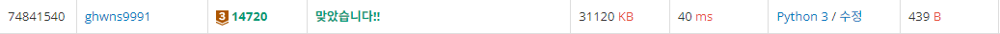
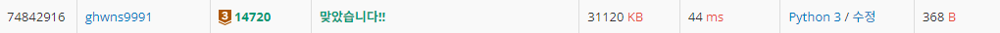

# Bronze-3 14720번

### 문제

영학이는 딸기우유, 초코우유, 바나나우유를 좋아한다.

입맛이 매우 까다로운 영학이는 자신만의 우유를 마시는 규칙이 있다.

<ol>
	<li>맨 처음에는 딸기우유를 한 팩 마신다.</li>
	<li>딸기우유를 한 팩 마신 후에는 초코우유를 한 팩 마신다.</li>
	<li>초코우유를 한 팩 마신 후에는 바나나우유를 한 팩 마신다.</li>
	<li>바나나우유를 한 팩 마신 후에는 딸기우유를 한 팩 마신다.&nbsp;</li>
</ol>

영학이는 우유 축제가 열리고 있는 우유거리에 왔다. 우유 거리에는 우유 가게들이 일렬로 늘어서 있다.

영학이는 우유 거리의 시작부터 끝까지 걸으면서 우유를 사먹고자 한다.

각각의 우유 가게는 딸기, 초코, 바나나 중 한 종류의 우유만을 취급한다.

각각의 우유 가게 앞에서, 영학이는 우유를 사마시거나, 사마시지 않는다.

우유거리에는 사람이 많기 때문에 한 번 지나친 우유 가게에는 다시 갈 수 없다.

영학이가 마실 수 있는 우유의 최대 개수를 구하여라.

### 입력

첫째 줄에 우유 가게의 수 N이 주어진다. (1 ≤ N ≤ 1000)

둘째 줄에는 우유 가게 정보가 우유 거리의 시작부터 끝까지 순서대로 N개의 정수로 주어진다.

0은 딸기우유만을 파는 가게, 1은 초코우유만을 파는 가게, 2는 바나나우유만을 파는 가게를 뜻하며, 0, 1, 2 외의 정수는 주어지지 않는다.

### 출력

영학이가 마실 수 있는 우유의 최대 개수를 출력하시오

### 내 풀이

#### 첫번째 제출
import sys
input = sys.stdin.readline

n = int(input())
count = 1

store = list(map(int, input().split()))

strawberry = store.index(0) #첫 딸기우유 위치
current = 0 #딸기우유

for i in range(strawberry + 1, n):
    #다음 가게가 (최근마신우유 + 1) % 3에 해당하는 가게라면 카운트+1
    if store[i] == (current + 1) % 3:
        count += 1
        current = store[i]
    else:
        continue

print(count)

맨 처음 우유는 딸기우유(0) 이어야 한다는 말에 꽂혀서 첫번째 딸기우유 위치를 찾아야겠다는 생각이 들었는데, 너무 어렵게 생각한 듯...

#### 두번째 제출
import sys
input = sys.stdin.readline

n = int(input())
count = 0
store = list(map(int, input().split()))

current = 0 #처음은 딸기우유

for i in store:
    #다음 가게가 (최근마신우유 + 1) % 3에 해당하는 가게라면 카운트+1
    if current == i:
        count += 1
        current = (current + 1) % 3
    else:
        continue

print(count)

그냥 배열 내에서 찾아서 일치하면 count를 올리면 되는 문제였다.