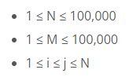
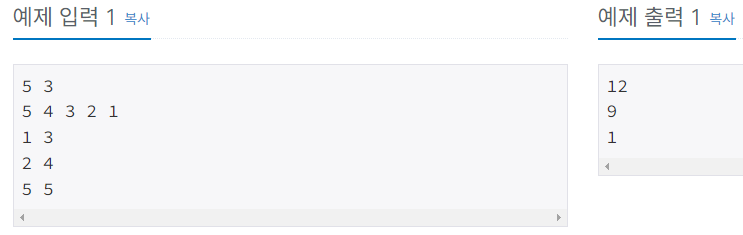
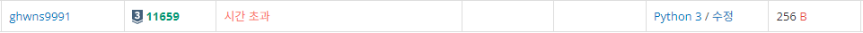
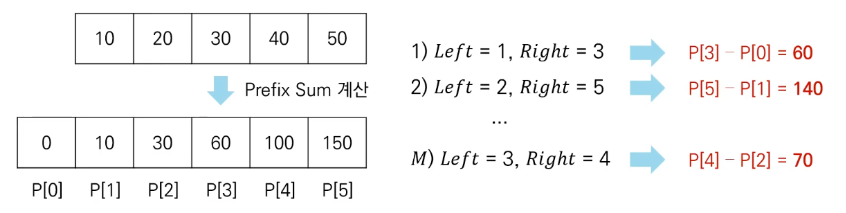

# Silver-3 11659번

### 문제
<p>수 N개가 주어졌을 때, i번째 수부터 j번째 수까지 합을 구하는 프로그램을 작성하시오.</p>

### 입력
<p>첫째 줄에 수의 개수 N과 합을 구해야 하는 횟수 M이 주어진다. 둘째 줄에는 N개의 수가 주어진다. 수는 1,000보다 작거나 같은 자연수이다. 셋째 줄부터 M개의 줄에는 합을 구해야 하는 구간 i와 j가 주어진다.</p>

### 출력
<p>총 M개의 줄에 입력으로 주어진 i번째 수부터 j번째 수까지 합을 출력한다.</p>

### 제한


### 예제 입력


### 내 풀이 1
```python
import sys

input = sys.stdin.readline

N, M = map(int, input().split())
num = list(map(int, input().split()))

for i in range(M):
    start, end = map(int, input().split())
    sum = 0
    for i in range(start-1, end):
        sum += num[i]
    print(sum)
```

결과는 시간 초과.


리스트를 하나하나 조회하며 더하기에는 시간이 오래걸린다.

### 내 풀이 2
```python
import sys

input = sys.stdin.readline

N, M = map(int, input().split())
num = list(map(int, input().split()))

#접두사 합 구하기
prefix_sum = [0]
sum_num = 0
for i in num:
    sum_num += i
    prefix_sum.append(sum_num)

for _ in range(M):
    start, end = map(int, input().split())
    print(prefix_sum[end] - prefix_sum[start-1])
```

### 구간 합
구간 합을 구하는 별도의 알고리즘이 존재했다.

#### 구간 합 문제
연속적으로 나열된 N개의 수가 있을 때 특정 구간의 모든 수를 합한 값을 계산하는 문제.

#### 문제 해결 아이디어
접두사 합(Prefix Sum): 배열의 맨 앞부터 특정 위치까지의 합을 미리 구해 놓은 것.

접두사 합을 활용한 알고리즘은 다음과 같다.
- N개의 수 위치 각각에 대해 접두사 합을 계산하여 P에 저장한다.
- 매 M개의 쿼리정보를 확인할 때 구간 합은 P[Right] - P[Left -1]이다.


