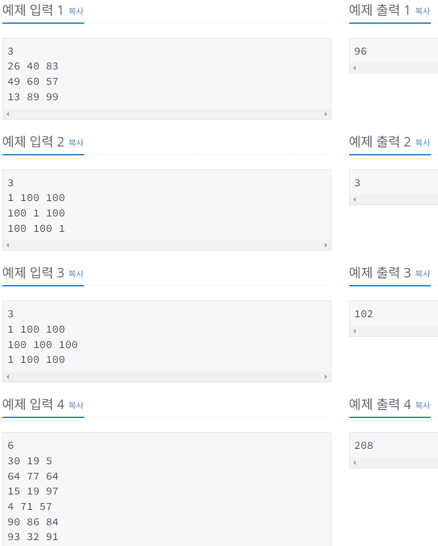
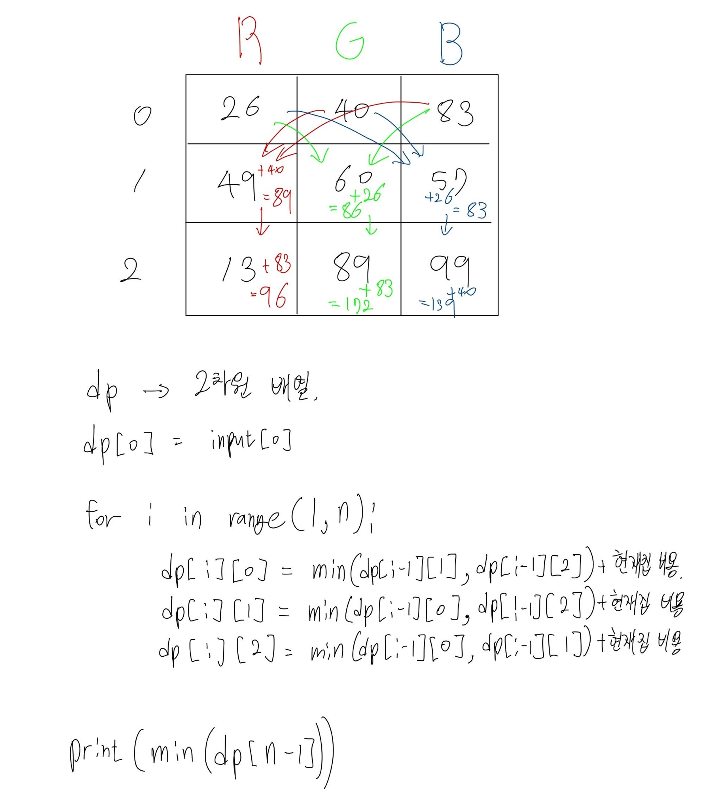

# Silver-1 1149번

### 문제
<p>RGB거리에는 집이 N개 있다. 거리는 선분으로 나타낼 수 있고, 1번 집부터 N번 집이 순서대로&nbsp;있다.</p>

<p>집은 빨강, 초록, 파랑 중 하나의 색으로 칠해야 한다. 각각의 집을 빨강, 초록, 파랑으로 칠하는 비용이 주어졌을 때, 아래 규칙을 만족하면서 모든 집을 칠하는 비용의 최솟값을 구해보자.</p>

<ul>
	<li>1번 집의 색은 2번 집의 색과 같지 않아야 한다.</li>
	<li>N번 집의 색은 N-1번 집의 색과 같지 않아야 한다.</li>
	<li>i(2 ≤ i ≤ N-1)번 집의 색은 i-1번, i+1번 집의 색과 같지 않아야 한다.</li>
</ul>

### 입력
<p>첫째 줄에 집의 수 N(2 ≤ N ≤ 1,000)이 주어진다. 둘째 줄부터 N개의 줄에는 각 집을 빨강, 초록, 파랑으로 칠하는 비용이 1번 집부터 한 줄에 하나씩 주어진다. 집을 칠하는 비용은 1,000보다 작거나 같은 자연수이다.</p>

### 출력
<p>첫째 줄에 모든 집을 칠하는 비용의 최솟값을 출력한다.</p>

### 예제 입력


### 다른 사람의 풀이
```python
import sys
input = sys.stdin.readline

N = int(input())
# cost = []
# for i in range(N):
#     cost.append(input().strip().split())
cost = [list(map(int, input().split())) for _ in range(N)]

dp = [[0] * 3 for _ in range(N)] #비용 계산을 위한 배열
dp[0] = cost[0]

for i in range(1,N):
    #현재 열(색깔)을 제외한 i-1행의 열들 중 최솟값 + 현재 칸 비용
    dp[i][0] = min(dp[i-1][1], dp[i-1][2]) + cost[i][0]
    dp[i][1] = min(dp[i-1][0], dp[i-1][2]) + cost[i][1]
    dp[i][2] = min(dp[i-1][0], dp[i-1][1]) + cost[i][2]

print(min(dp[N-1]))
```

내가 풀다가 갈피가 잡히지 않아서 다른 사람의 코드를 찾아보았다.



비용을 계산하고 기록하기 위한 dp 배열을 생성하고,
첫 행에 첫번째 집에 각 색을 칠하는 비용을 먼저 채워놓는다.
다음 집을 칠할 때, 이전 집에서 칠한 색을 제외한 색 중에 더 저렴한 색을 칠하도록 하였다.

dp 배열의 마지막 행에는 누적된 값이 존재하므로, 이 중에서 가장 적은 비용을 출력하면 된다.