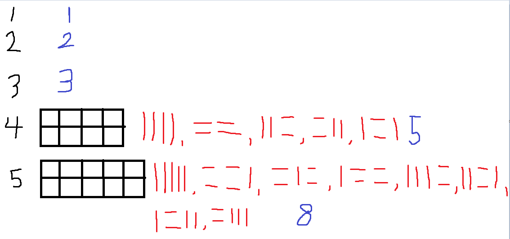

# Silver-3 11726번

### 문제
<p>2×n 크기의 직사각형을 1×2, 2×1 타일로 채우는 방법의 수를 구하는 프로그램을 작성하시오.

아래 그림은 2×5 크기의 직사각형을 채운 한 가지 방법의 예이다.</p>


### 입력
<p>첫째 줄에 n이 주어진다. (1 ≤ n ≤ 1,000)</p>

### 출력
<p>첫째 줄에 2×n 크기의 직사각형을 채우는 방법의 수를 10,007로 나눈 나머지를 출력한다.</p>

### 예제 입력


### 나의 풀이
```python
import sys

input = sys.stdin.readline

n = int(input())

dp = [0] * 1001

dp[1] = 1
dp[2] = 2

for i in range(3, 1001):
    dp[i] = dp[i-1] + dp[i-2]

print(dp[n] % 10007)
```

n이 1,2,3,4,5 일 때의 방법의 갯수를 세어보면 다음과 같다.



다음과 같은 점화식을 발견할 수 있다.
dp[n] = dp[n-1] + dp[n-2]


### 시간을 줄일 수 있지 않을까?
3에서 1001까지의 dp를 연산하고, 저장하면 더 오래걸리지 않을까? 하는 생각에 다른 풀이도 작성해보았다.

```python
import sys

input = sys.stdin.readline

n = int(input())

dp = [0] * 1001

dp[1] = 1
dp[2] = 2

for i in range(3, n+1):
    dp[i] = dp[i-1] + dp[i-2]
print(dp[n] % 10007)
```

입력받은 n까지만 연산을 해서 저장하도록 수정하였다.


하지만, 오히려 시간이 더 증가하였다. 왜일까??

두 코드의 차이점은 for 루프의 반복 범위에 있다. 첫 번째 코드는 항상 i가 3부터 1000까지 반복되지만, 두 번째 코드는 n+1까지만 반복된다. 그럼에도 불구하고 두 번째 코드가 더 시간이 걸리는 이유는 입력값의 크기와 메모리 접근 패턴 때문일 수 있다.

#### 첫 번째 코드
```python
for i in range(3, 1001):
    dp[i] = dp[i-1] + dp[i-2]
```
- 이 코드는 항상 3부터 1000까지 1000번 반복을 수행한다.
- 따라서 입력 n의 크기와 무관하게 매번 고정된 시간에 계산이 완료된다. 즉, **O(1000)**의 시간 복잡도를 가진다.
- 이렇게 미리 모든 값을 계산해두기 때문에, 이후에 dp[n]을 바로 출력할 때는 추가적인 연산이 필요하지 않는다.

#### 두 번째 코드
```python
for i in range(3, n+1):
    dp[i] = dp[i-1] + dp[i-2]
```
- 이 코드는 n의 크기에 따라 반복 횟수가 달라진다. n이 작을 경우 반복 횟수가 줄어들고, n이 클 경우 최대 1000번까지 반복될 수 있다.
- 시간 복잡도는 **O(n)**으로, n이 커질수록 계산 시간이 길어진다.

#### 왜 두 번째 코드가 느릴 수 있는가?
두 코드의 시간 복잡도는 첫 번째 코드가 항상 **O(1000)**인 반면, 두 번째 코드는 **O(n)**이다. 이때 두 번째 코드가 더 느리게 동작하는 이유는 다음과 같은 이유로 설명될 수 있다.

1. 최악의 경우:

- 만약 n = 1000인 경우, 두 번째 코드는 처음부터 1000까지 계산을 반복해야 하므로 첫 번째 코드와 동일한 1000번의 연산을 하게 된다. 그러나 두 번째 코드는 for문에서 range(3, n+1)의 범위를 계산하는 추가 작업을 수행하므로, 아주 미세한 차이지만 그 과정에서 성능이 약간 더 떨어질 수 있다.

2. 메모리 접근 및 캐시:

- 첫 번째 코드는 dp 배열을 한 번에 채우므로 메모리 접근 패턴이 일정하며, CPU 캐시 활용에서 이점이 있을 수 있다.
- 두 번째 코드는 n의 크기에 맞춰서만 메모리 접근을 하므로, 최악의 경우와 첫 번째 코드와 같을 때 상대적으로 덜 효율적일 수 있다.

