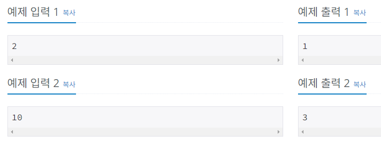

# Silver-3 1463번

### 문제
<p>정수 X에 사용할 수 있는 연산은 다음과 같이 세 가지 이다.

1. X가 3으로 나누어 떨어지면, 3으로 나눈다.
2. X가 2로 나누어 떨어지면, 2로 나눈다.
3. 1을 뺀다.

정수 N이 주어졌을 때, 위와 같은 연산 세 개를 적절히 사용해서 1을 만들려고 한다. 연산을 사용하는 횟수의 최솟값을 출력하시오.</p>

### 입력
<p>첫째 줄에 1보다 크거나 같고, 10^6보다 작거나 같은 정수 N이 주어진다.</p>

### 출력
<p>첫째 줄에 연산을 하는 횟수의 최솟값을 출력한다.</p>

### 예제 입력


### 다른 사람의 풀이
```python
import sys

input =sys.stdin.readline

N = int(input())

#DP 테이블 초기화
d = [0] * 1000001

#DP 진행(bottom-up)
for i in range(2, N+1):
    #현재의 수에서 1을 빼는 경우 -> 계산 횟수 +1
    d[i] = d[i-1] + 1   #이전 결과를 다음 결과에 이용.

    #현재의 수가 2로 나누어 떨어지는 경우
    if i % 2 == 0:
        #min(현재 수에서 1을 빼는 경우의 계산 횟수, 현재 수를 2로 나누었을 경우에 나오는 수의 계산 횟수 +1)
        d[i] = min(d[i], d[i//2] + 1) 

    if i % 3 == 0:
        #min(현재 수에서 1을 빼는 경우의 계산 횟수, 현재 수를 3으로 나누었을 경우에 나오는 수의 계산 횟수 +1)
        d[i] = min(d[i], d[i//3] + 1) 

print(d[N])
```

이전의 결과를 다음 결과에 이용하게 되는 점화식을 활용한 DP 문제이다.
메모제이션 방법으로 중복해 계산되는 값을 저장하여 효율을 높인다.

처음 두 수를 알기 때문에 상향식(bottom-up)으로 풀이할 수 있다.

X = 10인 경우, <b>10 -> 9 -> 3 -> 1</b> 과정을 거쳐 1이 되게 되는데

9의 경우에는 또, <b>9 -> 3 -> 1</b>의 과정을 거치며

3의 경우에는 <b>3 -> 1</b>의 과정을 거친다.

<b>즉, 10을 구할 때는 9의 결과를, 9를 구할 때는 3의 결과를 이용한다.</b>

앞에서 구한 결과값을 저장하였다가 후에 사용하는 것이다.

일단, 2와 3으로 나누어 떨어지지 않는 경우는 무조건 1을 빼야 하기 때문에

dp[i] = dp[i-1] + 1을 통해 횟수를 +1 해준다.

그리고나서, dp[i]가 2와 3으로 나누어 떨어지는 경우에는 <b>dp[i](현재 수에서 1을 빼는 경우의 계산 횟수)</b>와 <b>dp[i//2or3] + 1(현재 수를 2나 3으로 나누었을 경우에 나오는 수의 계산 횟수 +1)</b> 중 최소값을 선택한다.

