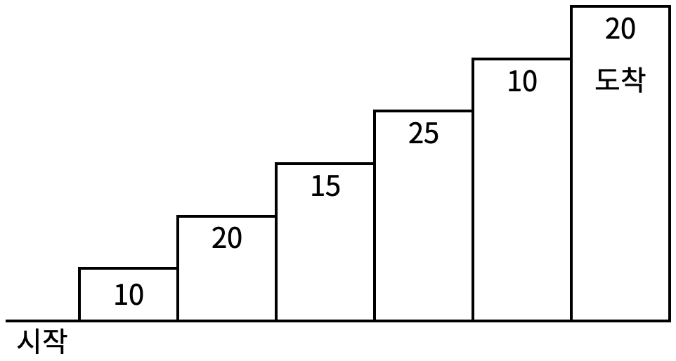
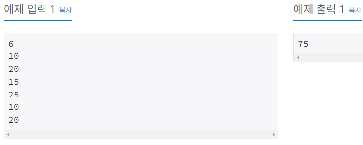
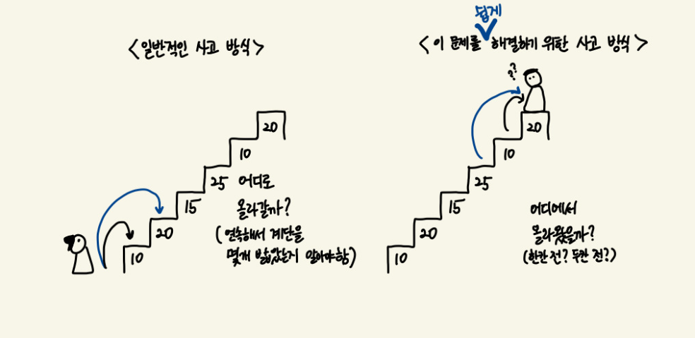

# Silver-3 2579번

### 문제
<p>계단 오르기 게임은 계단 아래 시작점부터 계단 꼭대기에 위치한 도착점까지 가는 게임이다. <그림 1>과 같이 각각의 계단에는 일정한 점수가 쓰여 있는데 계단을 밟으면 그 계단에 쓰여 있는 점수를 얻게 된다.</p>



<p>예를 들어 <그림 2>와 같이 시작점에서부터 첫 번째, 두 번째, 네 번째, 여섯 번째 계단을 밟아 도착점에 도달하면 총 점수는 10 + 20 + 25 + 20 = 75점이 된다.</p>


<p>계단 오르는 데는 다음과 같은 규칙이 있다.

계단은 한 번에 한 계단씩 또는 두 계단씩 오를 수 있다. 즉, 한 계단을 밟으면서 이어서 다음 계단이나, 다음 다음 계단으로 오를 수 있다.
연속된 세 개의 계단을 모두 밟아서는 안 된다. 단, 시작점은 계단에 포함되지 않는다.
마지막 도착 계단은 반드시 밟아야 한다.
따라서 첫 번째 계단을 밟고 이어 두 번째 계단이나, 세 번째 계단으로 오를 수 있다. 하지만, 첫 번째 계단을 밟고 이어 네 번째 계단으로 올라가거나, 첫 번째, 두 번째, 세 번째 계단을 연속해서 모두 밟을 수는 없다.

각 계단에 쓰여 있는 점수가 주어질 때 이 게임에서 얻을 수 있는 총 점수의 최댓값을 구하는 프로그램을 작성하시오.</p>

### 입력
<p>입력의 첫째 줄에 계단의 개수가 주어진다.

둘째 줄부터 한 줄에 하나씩 제일 아래에 놓인 계단부터 순서대로 각 계단에 쓰여 있는 점수가 주어진다. 계단의 개수는 300이하의 자연수이고, 계단에 쓰여 있는 점수는 10,000이하의 자연수이다.</p>

### 출력
<p>첫째 줄에 계단 오르기 게임에서 얻을 수 있는 총 점수의 최댓값을 출력한다.</p>

### 예제 입력


### 나의 풀이
```python
import sys

input = sys.stdin.readline

N = int(input())

stairs = [0] * 301   #계단의 최대 갯수만큼 배열 초기화
dp = [0] * 301   #인덱스는 현재 계단 위치, 값은 그 위치에 있을 때의 최대값

for i in range(1, N+1):
    stairs[i] = int(input())

# 각 계단을 밟았을 때의 점수 최댓값
dp[1] = stairs[1]
dp[2] = stairs[1] + stairs[2]
dp[3] = max(stairs[1] + stairs[3], stairs[2] + stairs[3])

for i in range(4,N+1):
    dp[i] = max(dp[i-3] + stairs[i] + stairs[i-1], dp[i-2] + stairs[i])

print(dp[N])
```

힌트를 찾아보다가, "다임하게"님의 그림을 보고 이해할 수 있었다.



"어떤 계단을 밟고 올라갈 것인가"가 아니라, "어떤 계단을 밟고 올라왔는가"를 생각하는 것이 더 간단한 해결법이다.


dp(n) = max(직전 칸에서 올라온 경우의 최대값, 전전 칸에서 올라온 경우의 최댓값)

직전 칸에서 올라온 경우, 전전 칸은 밟을 수 없기 때문에, 전전전 칸의 dp를 더해야 한다.
- dp(n-3) + stairs[n] + stairs[n-1]

전전 칸에서 올라온 경우, 전전 칸의 dp와 올라온 현재 칸의 점수를 더해주면 된다.
- dp(n-2) + stairs[n]

따라서 점화식은 
- dp(n) = max(dp(n-3) + stairs[n] + stairs[n-1], dp(n-2) + stairs[n])

출처 "다임하게"
https://daimhada.tistory.com/181


