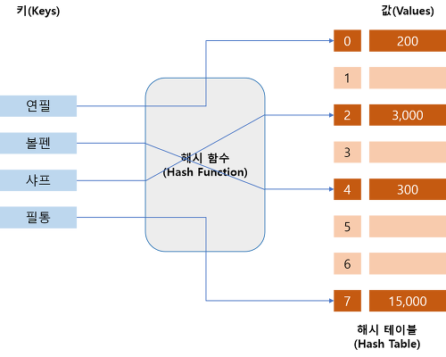
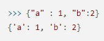
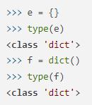
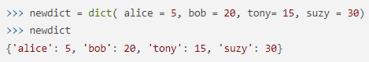
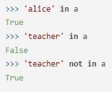

## 해시 태이블(Hash Table), 딕셔너리(dictionary)

### Hash Table
- 키(Key)에 데이터(Value)를 저장하는 데이터 구조이다.
- Key를 통해서 데이터를 바로 받아올 수 있다. -> 데이터 탐색 속도가 빠르다.
- 보통 배열로 미리 Hash Table 사이즈 만큼 생성 한 후에 사용한다.
- 파이썬에서는 해시를 별도로 구현할 필요 없이, <code>Dictionary</code>를 사용하면 된다.

### dictionary(딕셔너리)
<b>예시문제 1764, 17219</b>

- 딕셔너리 타입은 immutable한 키(key)와 mutable한 값(value)으로 매핑되어 있는 순서가 없는 집합이다.
- 일반적인 딕셔너리 타입의 모습은 아래와 같이 중괄호 안에 키와 값이 있는 형태이다.

- 값은 중복될 수 있지만, 키가 중복되면 마지막 값으로 덮어씌워진다.
- 순서가 없기 때문에 인덱스로는 접근할 수 없고, Key로 접근할 수 있다.

#### dictionary 선언
- 딕셔너리를 선언할 때에는 <code>빈 중괄호("{}")</code>를 사용하거나, 명시적으로 <code>dict()</code>를 사용한다.

- 명시적인 방법을 사용 시, 아래와 같이 키와 값을 할당하며 선언할 수 있다.

#### dictionary의 in
- dictionary에서의 in은 key에 한해서 동작한다.
- key에 한해서 동작하므로, <b>시간복잡도가 O(1)</b> 이다.

