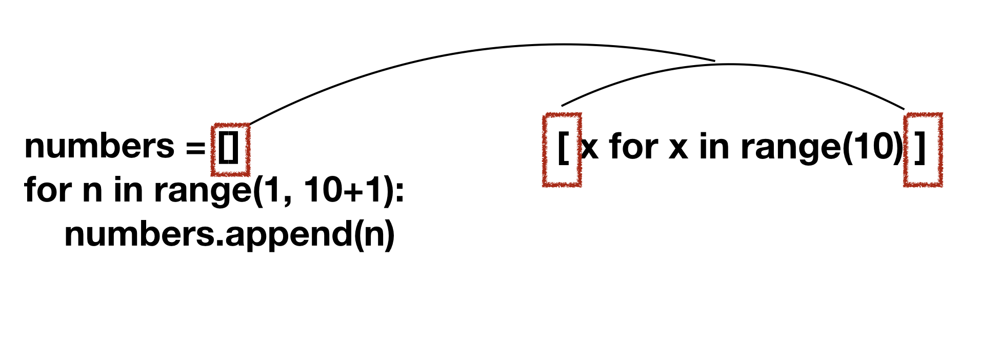
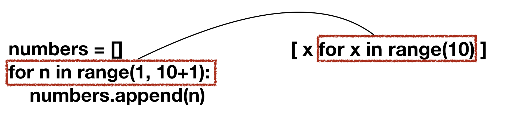
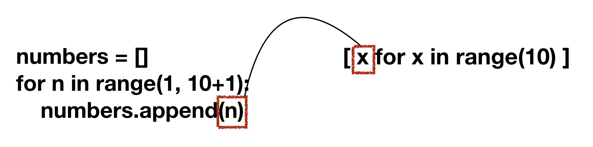

# 리스트 컴프리헨션(List Comprehension)

<p>1부터 10까지의 정수를 순서대로 가지는 리스트를 생성하는 기본적인 코드는 다음과 같다.</p>

```python
numbers = []
for n in range(1, 10+1):
    numbers.append(n)
```
<p>이러한 코드를 컴프리헨션으로 표기하면 다음과 같다.</p>

```python
[x for x in range(10)]
```

<p>리스트 컴프리헨션이 작동하는 방식을 for문과 비교하면 다음과 같다.</p>





<p>대괄호를 통해 리스트를 생성하는 방식은 동일하다. 차이점은 컴프리헨션은 리스트 내부에 코드를 작성한다는 점이다.</p>



<p>리스트 컴프리헨션은 for문에서 반복되는 변수를 콜론(:)다음에 줄을 바꿔 들여쓰기 하는것이 아니라, for문 앞에 작성한다.</p>
<p>컴프리헨션에서 사용한 x는 for문 내부에서 append 메소드에 인자로 넣은 변수 n과 같다.</p>

<p>만약, 2의 배수를 10개 가지고 있는 리스트를 컴프리헨션을 사용해서 만들면 다음과 같다.</p>

```python
[2*x for x in range(1, 10+1)]
```


## 조건 걸기

<p>만약 1부터 10까지 짝수만 순차적으로 들어있는 리스트를 생성하는 기본적인 코드는 다음과 같다.</p>

```python
even_nums = []
for n in range(1, 10+1):
    if n % 2 == 0:
        even_nums.append(n)
```

<p>리스트 컴프리헨션으로도 조건을 설정할 수 있다.</p>

```python
[x for x in range(1, 10+1) if x % 2 == 0]
```

## 중복 표현
<p>컴프리헨션 내부에서 for 키워드와 if 키워드를 몇번이고 반복할 수 있다.</p>

### for
<p>저녁메뉴 짜장, 짬뽕, 볶음밥 중 하나와 후식인 과일, 과자, 아이스크림 중 하나씩 선택하는 경우의 수를 컴프리헨션으로 표현하면 다음과 같다.</p>

```python
a = [ (x,y) for x in ['짜장', '짬뽕', '볶음밥'] for y in ['과일', '과자', '아이스크림']]
print(a)
```

<p>결과
[('짜장', '과일'), ('짜장', '과자'), ('짜장', '아이스크림'), ('짬뽕', '과일'), ('짬뽕', '과자'), ('짬뽕', '아이스크림'), ('볶음밥', '과일'), ('볶음밥', '과자'), ('볶음밥', '아이스크림')]
</p>

<p>for문이 작동하는 순서는 왼쪽에 있는 for문이 먼저 작동한다.</p>

### if
<p>if문 또한 중복해서 작성하여 여러 조건을 걸 수 있다.</p>

```python
a = [x for x in range(10) if x < 5 if x % 2 == 0]
print(a)
```

<p>결과
[0, 2, 4]
</p>


## 2차원 배열
예제문제 2563

### 선언하기

```python
rows = 10 #10행
cols = 5 #5열
arr = [[0 for j in range(cols)] for i in range(rows)]
```

```plaintext
[[0, 0, 0, 0, 0], [0, 0, 0, 0, 0], [0, 0, 0, 0, 0], [0, 0, 0, 0, 0], [0, 0, 0, 0, 0], [0, 0, 0, 0, 0], [0, 0, 0, 0, 0], [0, 0, 0, 0, 0], [0, 0, 0, 0, 0], [0, 0, 0, 0, 0]]
```

### 2차원 배열에서 특정 값의 개수 찾기

```python
# 2차원 배열(리스트)
matrix = [
    [1, 2, 3],
    [4, 1, 6],
    [7, 8, 1]
]

# 특정 값
target = 1

# 리스트 컴프리헨션과 sum 함수를 사용하여 특정 값의 개수를 셈
count = sum(element == target for row in matrix for element in row)

print(f"{target}의 개수: {count}")
```

위의 리스트 컴프리헨션 부분은 아래의 for문과 같다.

```python
for row in matrix:
    for element in row:
        if element == target:
            count += 1
```


