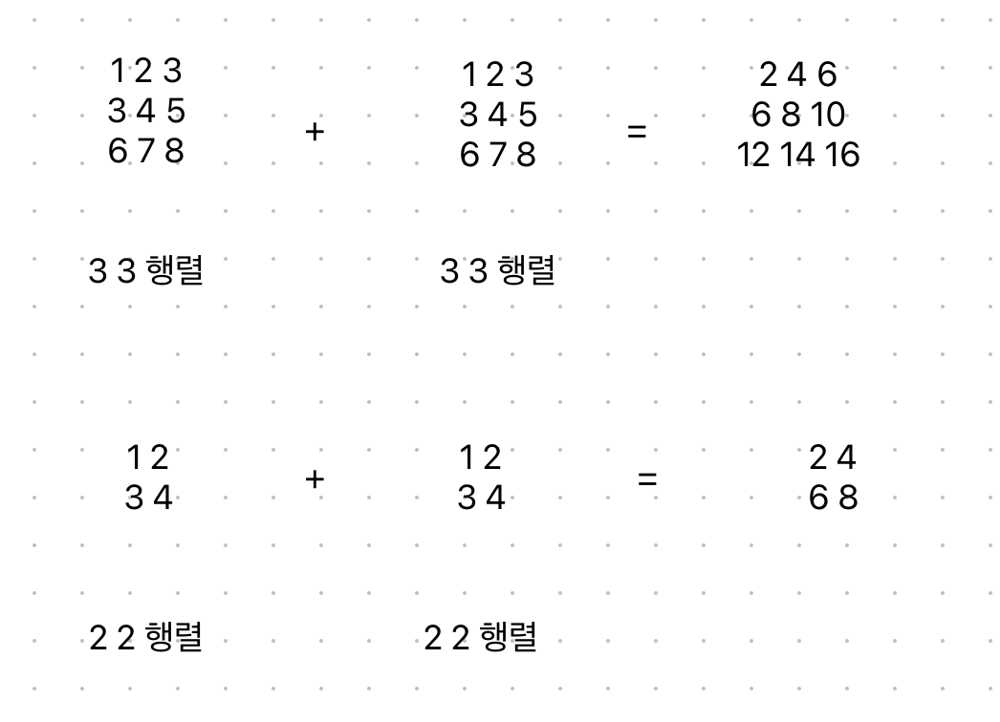

## 행렬의 덧셈
예시문제 2738

행렬의 덧셈은 이런식으로 이루어진다.


<b>리스트 안에는 리스트가 들어갈 수 있다.</b>

```python
a = []
a.append([1, 2, 3]) # a = [[1,2,3]]
a.append([2, 3, 4]) # a = [[1,2,3], [2,3,4]]
b = []
b.append([1,3,5]) # b = [[1,3,5]]
b.append([2,4,6]) # b = [[1,3,5],[2,4,6]]
print(a[1][1] + b[1][1]) # 3 + 4
```