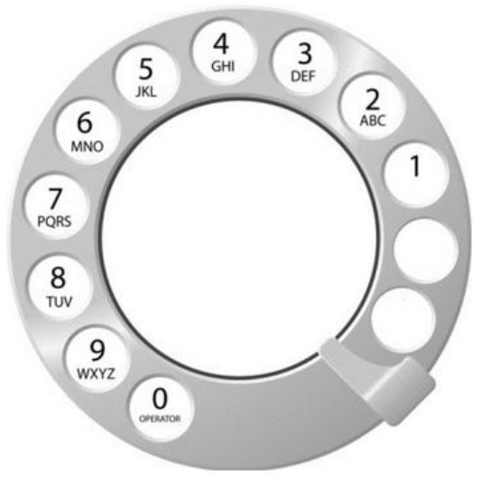
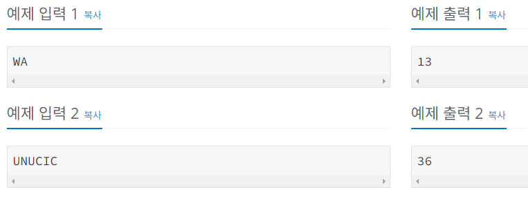
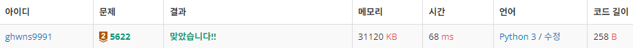

# Bronze-2 5622번

### 문제
<p>상근이의 할머니는 아래 그림과 같이 오래된 다이얼 전화기를 사용한다.</p>



<p>전화를 걸고 싶은 번호가 있다면, 숫자를 하나를 누른 다음에 금속 핀이 있는 곳 까지 시계방향으로 돌려야 한다. 숫자를 하나 누르면 다이얼이 처음 위치로 돌아가고, 다음 숫자를 누르려면 다이얼을 처음 위치에서 다시 돌려야 한다.

숫자 1을 걸려면 총 2초가 필요하다. 1보다 큰 수를 거는데 걸리는 시간은 이보다 더 걸리며, 한 칸 옆에 있는 숫자를 걸기 위해선 1초씩 더 걸린다.

상근이의 할머니는 전화 번호를 각 숫자에 해당하는 문자로 외운다. 즉, 어떤 단어를 걸 때, 각 알파벳에 해당하는 숫자를 걸면 된다. 예를 들어, UNUCIC는 868242와 같다.

할머니가 외운 단어가 주어졌을 때, 이 전화를 걸기 위해서 필요한 최소 시간을 구하는 프로그램을 작성하시오.</p>

### 입력
<p>첫째 줄에 알파벳 대문자로 이루어진 단어가 주어진다. 단어의 길이는 2보다 크거나 같고, 15보다 작거나 같다.</p>

### 출력
<p>첫째 줄에 다이얼을 걸기 위해서 필요한 최소 시간을 출력한다.</p>

### 예제


### 내 풀이

```python
import sys
input = sys.stdin.readline

alpha_list = ["ABC", "DEF", "GHI", "JKL", "MNO", "PQRS", "TUV", "WXYZ"]
time = 0

word = input()

for i in word:
    for idx, alpha in enumerate(alpha_list):
        if i in alpha:
            time += idx+3
print(time)
```

각 번호에 해당하는 알파벳들을 리스트에 담아두고, 입력으로 알파벳이 들어왔을 때, 리스트와 비교하여 해당 알파벳의 인덱스 값을 구하여 시간을 더하는 방식으로 풀이하였다.


