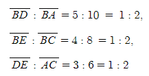

# Silver-4 31534번

### 문제

<p>지난해 현대모비스 알고리즘 경진대회에 참가한 재우는 기념품 중 하나로 다음과 같이 생긴 휴대용 선풍기를 받았다. 선풍기는 바람이 나오는 부분과 선풍기를 받치는 부분으로 이루어져 있다. 재우는 심심할 때 선풍기 받침대를 바닥에 굴리며 놀다가 문득 새삼 선풍기 받침이 굴러갈 때 자취의 넓이가 궁금해져서 다음과 같은 문제를 만들었다.</p>
<p>두 밑변의 길이가 <mjx-container class="MathJax" jax="CHTML" style="font-size: 109%; position: relative;"><mjx-math class="MJX-TEX" aria-hidden="true"><mjx-mi class="mjx-i"><mjx-c class="mjx-c1D44E TEX-I"></mjx-c></mjx-mi></mjx-math><mjx-assistive-mml unselectable="on" display="inline"><math xmlns="http://www.w3.org/1998/Math/MathML"><mi></mi></math></mjx-assistive-mml><span aria-hidden="true" class="no-mathjax mjx-copytext">$a$</span></mjx-container>, <mjx-container class="MathJax" jax="CHTML" style="font-size: 109%; position: relative;"><mjx-math class="MJX-TEX" aria-hidden="true"><mjx-mi class="mjx-i"><mjx-c class="mjx-c1D44F TEX-I"></mjx-c></mjx-mi></mjx-math><mjx-assistive-mml unselectable="on" display="inline"><math xmlns="http://www.w3.org/1998/Math/MathML"><mi></mi></math></mjx-assistive-mml><span aria-hidden="true" class="no-mathjax mjx-copytext">$b$</span></mjx-container>이며 다른 변 중 하나가 길이 <mjx-container class="MathJax" jax="CHTML" style="font-size: 109%; position: relative;"><mjx-math class="MJX-TEX" aria-hidden="true"><mjx-mi class="mjx-i"><mjx-c class="mjx-c210E TEX-I"></mjx-c></mjx-mi></mjx-math><mjx-assistive-mml unselectable="on" display="inline"><math xmlns="http://www.w3.org/1998/Math/MathML"><mi></mi></math></mjx-assistive-mml><span aria-hidden="true" class="no-mathjax mjx-copytext">$h$</span></mjx-container>로 두 밑변과 수직을 이루는 사다리꼴을 생각하자. 이때, 이 변을 <strong>높이변</strong>이라고 하자. 만약 <mjx-container class="MathJax" jax="CHTML" style="font-size: 109%; position: relative;"><mjx-math class="MJX-TEX" aria-hidden="true"><mjx-mi class="mjx-i"><mjx-c class="mjx-c1D44E TEX-I"></mjx-c></mjx-mi><mjx-mo class="mjx-n" space="4"><mjx-c class="mjx-c3D"></mjx-c></mjx-mo><mjx-mn class="mjx-n" space="4"><mjx-c class="mjx-c30"></mjx-c></mjx-mn></mjx-math><mjx-assistive-mml unselectable="on" display="inline"><math xmlns="http://www.w3.org/1998/Math/MathML"><mi></mi><mo></mo><mn></mn></math></mjx-assistive-mml><span aria-hidden="true" class="no-mathjax mjx-copytext">$a=0$</span></mjx-container>이라면, 사다리꼴이 아닌 삼각형이라고 생각할 수 있다.</p>
<p>이 사다리꼴을 <strong>높이변</strong>을 축으로 하여 회전시키면 오른쪽과 같은 입체 도형 <mjx-container class="MathJax" jax="CHTML" style="font-size: 109%; position: relative;"><mjx-math class="MJX-TEX" aria-hidden="true"><mjx-mi class="mjx-i"><mjx-c class="mjx-c1D446 TEX-I"></mjx-c></mjx-mi></mjx-math><mjx-assistive-mml unselectable="on" display="inline"><math xmlns="http://www.w3.org/1998/Math/MathML"><mi></mi></math></mjx-assistive-mml><span aria-hidden="true" class="no-mathjax mjx-copytext">$S$</span></mjx-container>가 하나 나온다.</p>


<p>이제 이 도형의 옆면을 바닥에 놓고 아래와 같이 무한히 굴린다.</p>


<p>도형의 옆면이 만드는 자취가 남게 될 것이다. 이 자취의 넓이를 구해보자.</p>
<p>이 도형을 굴리는 동안 넘어지지 않으며, 미끄러지지 않는다고 가정한다.</p>

### 입력

<p>첫 번째 줄에 문제에서 주어진 세 정수 <mjx-container class="MathJax" jax="CHTML" style="font-size: 109%; position: relative;"><mjx-math class="MJX-TEX" aria-hidden="true"><mjx-mi class="mjx-i"><mjx-c class="mjx-c1D44E TEX-I"></mjx-c></mjx-mi></mjx-math><mjx-assistive-mml unselectable="on" display="inline"><math xmlns="http://www.w3.org/1998/Math/MathML"><mi></mi></math></mjx-assistive-mml><span aria-hidden="true" class="no-mathjax mjx-copytext">$a$</span></mjx-container>, <mjx-container class="MathJax" jax="CHTML" style="font-size: 109%; position: relative;"><mjx-math class="MJX-TEX" aria-hidden="true"><mjx-mi class="mjx-i"><mjx-c class="mjx-c1D44F TEX-I"></mjx-c></mjx-mi></mjx-math><mjx-assistive-mml unselectable="on" display="inline"><math xmlns="http://www.w3.org/1998/Math/MathML"><mi></mi></math></mjx-assistive-mml><span aria-hidden="true" class="no-mathjax mjx-copytext">$b$</span></mjx-container>, <mjx-container class="MathJax" jax="CHTML" style="font-size: 109%; position: relative;"><mjx-math class="MJX-TEX" aria-hidden="true"><mjx-mi class="mjx-i"><mjx-c class="mjx-c210E TEX-I"></mjx-c></mjx-mi></mjx-math><mjx-assistive-mml unselectable="on" display="inline"><math xmlns="http://www.w3.org/1998/Math/MathML"><mi></mi></math></mjx-assistive-mml><span aria-hidden="true" class="no-mathjax mjx-copytext">$h$</span></mjx-container>가 공백으로 구분되어 주어진다. <mjx-container class="MathJax" jax="CHTML" style="font-size: 109%; position: relative;"><mjx-math class="MJX-TEX" aria-hidden="true"><mjx-mo class="mjx-n"><mjx-c class="mjx-c28"></mjx-c></mjx-mo><mjx-mn class="mjx-n"><mjx-c class="mjx-c30"></mjx-c></mjx-mn><mjx-mo class="mjx-n" space="4"><mjx-c class="mjx-c2264"></mjx-c></mjx-mo><mjx-mi class="mjx-i" space="4"><mjx-c class="mjx-c1D44E TEX-I"></mjx-c></mjx-mi><mjx-mo class="mjx-n" space="4"><mjx-c class="mjx-c2264"></mjx-c></mjx-mo><mjx-mn class="mjx-n" space="4"><mjx-c class="mjx-c31"></mjx-c></mjx-mn><mjx-mstyle><mjx-mspace style="width: 0.167em;"></mjx-mspace></mjx-mstyle><mjx-mn class="mjx-n"><mjx-c class="mjx-c30"></mjx-c><mjx-c class="mjx-c30"></mjx-c><mjx-c class="mjx-c30"></mjx-c></mjx-mn><mjx-mo class="mjx-n"><mjx-c class="mjx-c3B"></mjx-c></mjx-mo></mjx-math><mjx-assistive-mml unselectable="on" display="inline"><math xmlns="http://www.w3.org/1998/Math/MathML"><mo stretchy="false"></mo><mn></mn><mo></mo><mi></mi><mo></mo><mn></mn><mstyle scriptlevel="0"><mspace width="0.167em"></mspace></mstyle><mn></mn><mo></mo></math></mjx-assistive-mml><span aria-hidden="true" class="no-mathjax mjx-copytext">$(0\le a\le 1\,000;$</span></mjx-container> <mjx-container class="MathJax" jax="CHTML" style="font-size: 109%; position: relative;"><mjx-math class="MJX-TEX" aria-hidden="true"><mjx-mn class="mjx-n"><mjx-c class="mjx-c31"></mjx-c></mjx-mn><mjx-mo class="mjx-n" space="4"><mjx-c class="mjx-c2264"></mjx-c></mjx-mo><mjx-mi class="mjx-i" space="4"><mjx-c class="mjx-c1D44F TEX-I"></mjx-c></mjx-mi><mjx-mo class="mjx-n"><mjx-c class="mjx-c2C"></mjx-c></mjx-mo><mjx-mi class="mjx-i" space="2"><mjx-c class="mjx-c210E TEX-I"></mjx-c></mjx-mi><mjx-mo class="mjx-n" space="4"><mjx-c class="mjx-c2264"></mjx-c></mjx-mo><mjx-mn class="mjx-n" space="4"><mjx-c class="mjx-c31"></mjx-c></mjx-mn><mjx-mstyle><mjx-mspace style="width: 0.167em;"></mjx-mspace></mjx-mstyle><mjx-mn class="mjx-n"><mjx-c class="mjx-c30"></mjx-c><mjx-c class="mjx-c30"></mjx-c><mjx-c class="mjx-c30"></mjx-c></mjx-mn><mjx-mo class="mjx-n"><mjx-c class="mjx-c29"></mjx-c></mjx-mo></mjx-math><mjx-assistive-mml unselectable="on" display="inline"><math xmlns="http://www.w3.org/1998/Math/MathML"><mn></mn><mo></mo><mi></mi><mo></mo><mi></mi><mo></mo><mn></mn><mstyle scriptlevel="0"><mspace width="0.167em"></mspace></mstyle><mn></mn><mo stretchy="false"></mo></math></mjx-assistive-mml><span aria-hidden="true" class="no-mathjax mjx-copytext">$1\le b,h\le 1\,000)$</span> </mjx-container></p>

### 출력

<p>주어진 사다리꼴로 만든 회전체 <mjx-container class="MathJax" jax="CHTML" style="font-size: 109%; position: relative;"><mjx-math class="MJX-TEX" aria-hidden="true"><mjx-mi class="mjx-i"><mjx-c class="mjx-c1D446 TEX-I"></mjx-c></mjx-mi></mjx-math><mjx-assistive-mml unselectable="on" display="inline"><math xmlns="http://www.w3.org/1998/Math/MathML"><mi></mi></math></mjx-assistive-mml><span aria-hidden="true" class="no-mathjax mjx-copytext">$S$</span></mjx-container>를 굴렸을 때 자취의 넓이를 출력한다.</p>

<p>단, 정답과의 절대오차 또는 상대오차가 <mjx-container class="MathJax" jax="CHTML" style="font-size: 109%; position: relative;"><mjx-math class="MJX-TEX" aria-hidden="true"><mjx-msup><mjx-mn class="mjx-n"><mjx-c class="mjx-c31"></mjx-c><mjx-c class="mjx-c30"></mjx-c></mjx-mn><mjx-script style="vertical-align: 0.393em;"><mjx-texatom size="s" texclass="ORD"><mjx-mo class="mjx-n"><mjx-c class="mjx-c2212"></mjx-c></mjx-mo><mjx-mn class="mjx-n"><mjx-c class="mjx-c36"></mjx-c></mjx-mn></mjx-texatom></mjx-script></mjx-msup></mjx-math><mjx-assistive-mml unselectable="on" display="inline"><math xmlns="http://www.w3.org/1998/Math/MathML"><msup><mn></mn><mrow data-mjx-texclass="ORD"><mo></mo><mn></mn></mrow></msup></math></mjx-assistive-mml><span aria-hidden="true" class="no-mathjax mjx-copytext">$10^{-6}$</span></mjx-container> 이하이면 정답으로 인정되며, 자취가 유한하지 않다면 <span style="color:#e74c3c;"><code>-1</code></span>을 출력한다.</p>

### 서브태스크
<div id="problem_subtask" class="problem-text"><div class="table-responsive"><table class="table table-bordered td-middle subtask-table" style="width: 100%;"><thead><tr><th style="width: 5%;">번호</th><th style="width: 5%;">배점</th><th style="width: 90%;">제한</th></tr></thead><tbody><tr data-subtask-id="1"><td>1</td><td>17</td><td class="subtask-body"><p><mjx-container class="MathJax" jax="CHTML" style="font-size: 109%; position: relative;"> <mjx-math class="MJX-TEX" aria-hidden="true"><mjx-mi class="mjx-i"><mjx-c class="mjx-c1D44E TEX-I"></mjx-c></mjx-mi><mjx-mo class="mjx-n" space="4"><mjx-c class="mjx-c3D"></mjx-c></mjx-mo><mjx-mn class="mjx-n" space="4"><mjx-c class="mjx-c30"></mjx-c></mjx-mn></mjx-math><mjx-assistive-mml unselectable="on" display="inline"><math xmlns="http://www.w3.org/1998/Math/MathML"><mi></mi><mo></mo><mn></mn></math></mjx-assistive-mml><span aria-hidden="true" class="no-mathjax mjx-copytext">$a=0$</span> </mjx-container></p>
</td></tr><tr data-subtask-id="2"><td>2</td><td>22</td><td class="subtask-body"><p><mjx-container class="MathJax" jax="CHTML" style="font-size: 109%; position: relative;"> <mjx-math class="MJX-TEX" aria-hidden="true"><mjx-mi class="mjx-i"><mjx-c class="mjx-c1D44E TEX-I"></mjx-c></mjx-mi><mjx-mo class="mjx-n" space="4"><mjx-c class="mjx-c3D"></mjx-c></mjx-mo><mjx-mn class="mjx-n" space="4"><mjx-c class="mjx-c31"></mjx-c></mjx-mn><mjx-mo class="mjx-n"><mjx-c class="mjx-c3B"></mjx-c></mjx-mo></mjx-math><mjx-assistive-mml unselectable="on" display="inline"><math xmlns="http://www.w3.org/1998/Math/MathML"><mi></mi><mo></mo><mn></mn><mo></mo></math></mjx-assistive-mml><span aria-hidden="true" class="no-mathjax mjx-copytext">$a=1;$</span></mjx-container> <mjx-container class="MathJax" jax="CHTML" style="font-size: 109%; position: relative;"><mjx-math class="MJX-TEX" aria-hidden="true"><mjx-mi class="mjx-i"><mjx-c class="mjx-c1D44F TEX-I"></mjx-c></mjx-mi><mjx-mo class="mjx-n" space="4"><mjx-c class="mjx-c3D"></mjx-c></mjx-mo><mjx-mn class="mjx-n" space="4"><mjx-c class="mjx-c32"></mjx-c></mjx-mn></mjx-math><mjx-assistive-mml unselectable="on" display="inline"><math xmlns="http://www.w3.org/1998/Math/MathML"><mi></mi><mo></mo><mn></mn></math></mjx-assistive-mml><span aria-hidden="true" class="no-mathjax mjx-copytext">$b=2$</span> </mjx-container></p>
</td></tr><tr data-subtask-id="3"><td>3</td><td>61</td><td class="subtask-body"><p>추가적인 제한 조건 없음</p>
</td></tr></tbody></table></div></div>

### 내 풀이 1
```python
import sys
import math
input = sys.stdin.readline

a, b, h = map(int, input().split())
if a==0:
    t = math.sqrt(h**2 + b**2)
    donut = t**2 * math.pi
    print(donut)
else:
    H = -b*h / (a-b)
    big_radius = math.sqrt(H**2 + b**2)
    small_radius = big_radius*a/b

    big_circle = big_radius**2 * math.pi
    small_circle = small_radius**2 * math.pi

    donut = big_circle - small_circle
    print(donut)
```
삼각비를 이용하여 계산해야하는 문제이다.




문제에 맞춰서 삼각비 공식을 대입해보았다.


그 결과, 큰 삼각형의 높이(H)를 구할 수 있었고, H를 이용해 큰 삼각형의 빗변 길이(T). 즉, 큰 원의 반지름(big_radius)을 구할 수 있었다.
큰 원의 반지름을 삼각비에 대입해서 작은 원의 반지름(small_radius)도 구할 수 있었다.
큰 원의 넓이에서 작은 원의 넓이를 빼면 이 문제는 클리어!

라고 생각했는데..


39점.. 문제를 다시한번 읽어보았다.


자취가 유한하지 않다.. 이 말이 무슨 뜻인지 생각해보았는데, 결론은 a와 b가 같을 경우에는 그냥 원통모양이 되어서, 굴렸을 때 자취가 원이 만들어지지 않고 직선으로 무한하므로 -1을 출력해야한다. 또, a가 b보다 클 경우도 생기는데, 이런 경우에는 a와 b의 변수 값을 swap 해주어서 연산을 수행하면 된다!

### 내 풀이 2
```python
import sys
import math
input = sys.stdin.readline

a, b, h = map(int, input().split())
if a==0:
    t = math.sqrt(h**2 + b**2)
    donut = t**2 * math.pi
    print(donut)
elif a==b:
    print(-1)
else:
    if a>b:
        a, b = b, a
    H = -b*h / (a-b)
    big_radius = math.sqrt(H**2 + b**2)
    small_radius = big_radius*a/b

    big_circle = big_radius**2 * math.pi
    small_circle = small_radius**2 * math.pi

    donut = big_circle - small_circle
    print(donut)
```


코딩테스트를 치루기 위해서는 수학적 지식도 기억 해두어야겠다...


