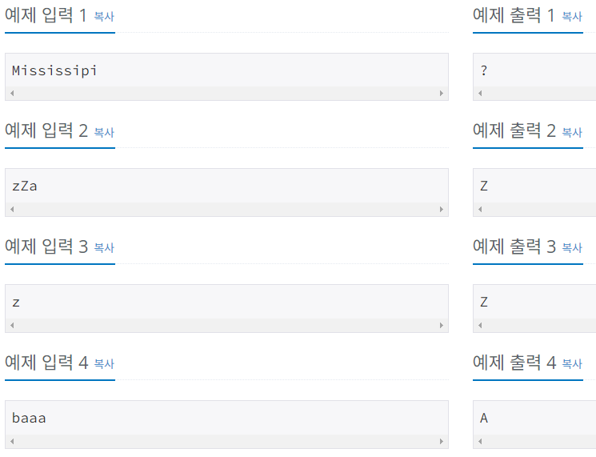

# Bronze-1 1157번

### 문제
<p>알파벳 대소문자로 된 단어가 주어지면, 이 단어에서 가장 많이 사용된 알파벳이 무엇인지 알아내는 프로그램을 작성하시오. 단, 대문자와 소문자를 구분하지 않는다.</p>

### 입력
<p>첫째 줄에 알파벳 대소문자로 이루어진 단어가 주어진다. 주어지는 단어의 길이는 1,000,000을 넘지 않는다.</p>

### 출력
<p>첫째 줄에 이 단어에서 가장 많이 사용된 알파벳을 대문자로 출력한다. 단, 가장 많이 사용된 알파벳이 여러 개 존재하는 경우에는 ?를 출력한다.</p>

### 예제


### 내 풀이 1

```python
import sys
input = sys.stdin.readline

word = input().upper()
alpha = list(set(word))

cnt = []

for i in alpha:
    c = word.count(i)
    cnt.append(c)

if cnt.count(max(cnt)) > 1:
    print("?")
else:
    print(alpha[(cnt.index(max(cnt)))])
```
먼저, 입력을 받으면 싹 대문자로 바꾸고, 단어에 있는 알파벳 숫자를 세기 위해 단어에서 쓰인 알파벳을 set()으로 추려내고 리스트로 저장했다.
이제 count() 함수를 사용하여, 단어에 해당 알파벳이 몇번 사용되는지, cnt라는 리스트에 저장하게 하였다.
이 cnt 리스트 안에 가장 큰 숫자가 2개 이상 존재한다면, ?를 출력하도록 하였다.
alpha의 인덱스와 cnt의 인덱스는 서로 매칭되기 때문에, cnt에서 가장 큰 숫자의 인덱스를 가져와서 alpha의 인덱스로 사용하면, 가장 많이 사용된 알파벳을 출력할 수 있게 된다.

입력에서 .strip()을 안해줬더니, 개행문자도 count를 하게 되어 제대로 된 값이 출력되지 않았다.

### 내 풀이 2

```python
import sys
input = sys.stdin.readline

word = input().strip().upper()
alpha = list(set(word))

cnt = []

for i in alpha:
    c = word.count(i)
    cnt.append(c)

if cnt.count(max(cnt)) > 1:
    print("?")
else:
    print(alpha[(cnt.index(max(cnt)))])
```
strip()을 사용하여, 개행문자를 제거해 줌으로써 오류를 수정하였다.


