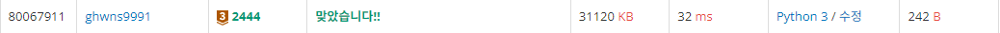
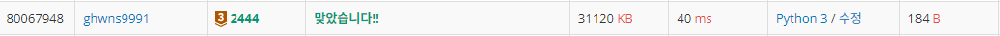

# Bronze-3 2444번

### 문제
<p>예제를 보고 규칙을 유추한 뒤에 별을 찍어 보세요.</p>

### 입력
<p>첫째 줄에 N(1 ≤ N ≤ 100)이 주어진다.</p>

### 출력
<p>첫째 줄부터 2×N-1번째 줄까지 차례대로 별을 출력한다.</p>

### 예제


### 내 풀이 1

```python
import sys
input = sys.stdin.readline

N = int(input())

if N == 1:
    print("*")
else:
    for i in range(1, N+1):
        print(" " *(N-i) + "*" * (2*i-1))
    for j in range(N-1, 0, -1):
        print(" " *(N-j) + "*" * (2*j-1))
```




### 내 풀이 2

```python
import sys
input = sys.stdin.readline

N = int(input())

for i in range(1, N+1):
    print(" " *(N-i) + "*" * (2*i-1))
for j in range(N-1, 0, -1):
    print(" " *(N-j) + "*" * (2*j-1))
```



첫 번째 풀이에서 N이 1일때의 상황을 따로 처리해주었는데, 이럴 필요 없을 것 같아서 두 번째 풀이에서는 해당 부분을 삭제했다.
그랬더니, 코드 길이는 58B 정도 줄어들었으나, 시간이 8ms 증가한 모습을 보였다.

단 하나의 경우라도, 반복문을 줄여주면 시간적 이득을 볼 수 있다는 것을 실감하게 되었다.
