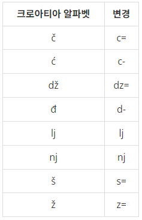
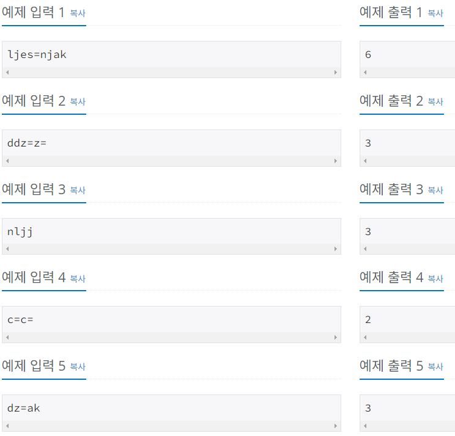
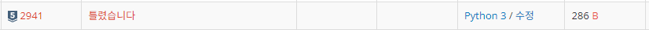
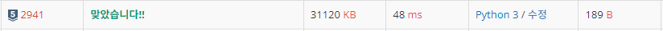

# Silver-5 2941번

### 문제
<p>예전에는 운영체제에서 크로아티아 알파벳을 입력할 수가 없었다. 따라서, 다음과 같이 크로아티아 알파벳을 변경해서 입력했다.</p>



<p>예를 들어, ljes=njak은 크로아티아 알파벳 6개(lj, e, š, nj, a, k)로 이루어져 있다. 단어가 주어졌을 때, 몇 개의 크로아티아 알파벳으로 이루어져 있는지 출력한다.

dž는 무조건 하나의 알파벳으로 쓰이고, d와 ž가 분리된 것으로 보지 않는다. lj와 nj도 마찬가지이다. 위 목록에 없는 알파벳은 한 글자씩 센다.</p>

### 입력
<p>첫째 줄에 최대 100글자의 단어가 주어진다. 알파벳 소문자와 '-', '='로만 이루어져 있다.

단어는 크로아티아 알파벳으로 이루어져 있다. 문제 설명의 표에 나와있는 알파벳은 변경된 형태로 입력된다.</p>

### 출력
<p>입력으로 주어진 단어가 몇 개의 크로아티아 알파벳으로 이루어져 있는지 출력한다.</p>

### 예제


### 내 풀이 1

```python
import sys
input = sys.stdin.readline

word = input().strip()
croatia = ["c=", "c-", "dz=", "d-", "lj", "nj", "s=", "z="]
count = 0

for i in croatia:
    if i in word:
        word = word.replace(i, " ")
        count += 1

word = word.replace(" ", "")
count += len(word)

print(count)
```
크로아티아 알파벳을 배열에 담아두고, 입력받은 문자열에 크로아티아 알파벳이 있다면 공백으로 대체한다.
확인이 모두 끝났으면 일반 알파벳만 남아있으므로 공백을 모두 제거한 후, 문자열의 길이를 count에 더해주면 될 것이라 생각했다!



결과는 오답! 4번째 예제인 c=c=에서 replace의 특성상 문자열 내에서 해당하는 단어를 모두 바꾸기 때문에, 출력이 1이 나온다..


### 내 풀이 2

```python
import sys
input = sys.stdin.readline

word = input().strip()
croatia = ["c=", "c-", "dz=", "d-", "lj", "nj", "s=", "z="]

for i in croatia:
    word = word.replace(i, "*")
print(len(word))
```

replace를 이용해 " "(공백)으로 바꾸었다가 제거하는 방식에서 문제가 발생한 것이기 때문에, 어차피 replace를 사용할 것이라면, 입력받은 문자열에서 크로아티아 알파벳을 *이라는 하나의 문자로 바꾸어서 길이를 세는 것이 맞다고 판단하였다.



정답!

너무 베베꼬아서 생각한 문제였다.