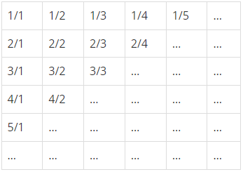
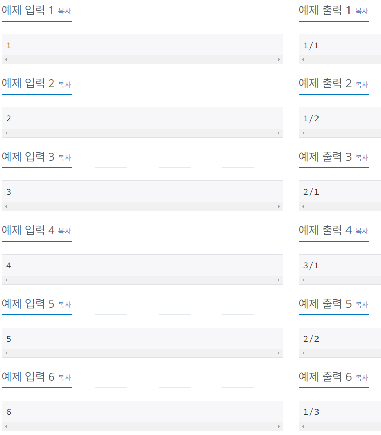
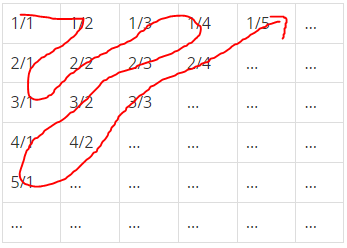
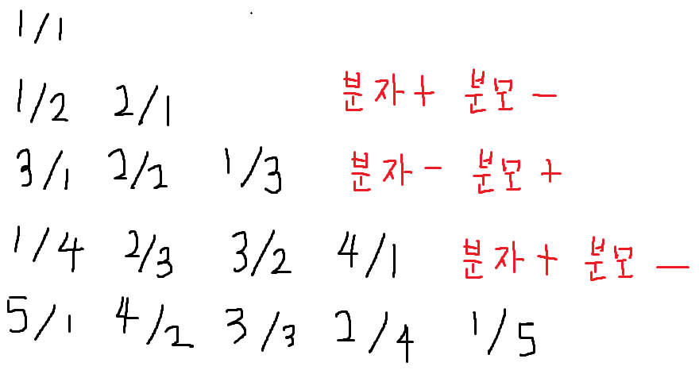

# Silver-5 1193번

### 문제
<p>무한히 큰 배열에 다음과 같이 분수들이 적혀있다.



이와 같이 나열된 분수들을 1/1 → 1/2 → 2/1 → 3/1 → 2/2 → … 과 같은 지그재그 순서로 차례대로 1번, 2번, 3번, 4번, 5번, … 분수라고 하자.

X가 주어졌을 때, X번째 분수를 구하는 프로그램을 작성하시오.
</p>

### 입력
<p>첫째 줄에 X(1 ≤ X ≤ 10,000,000)가 주어진다.</p>

### 출력
<p>첫째 줄에 분수를 출력한다.</p>

### 예제


### 내 풀이
```python
import sys

input = sys.stdin.readline

X = int(input())

line = 1

while X > line: #몇 번째 줄에 해당하는지 체크
    X -= line
    line += 1

if line % 2 == 0:
    numer = X
    denom = line-(X-1)
else:
    numer = line-(X-1)
    denom = X

print(f'{numer}/{denom}')
```

지그재그 순서대로이기 때문에 다음과 같은 순서이다.



줄마다 순서대로 나열해보고 규칙을 발견할 수 있었다.


짝수 줄에서는 분자가 1씩 증가하고, 분모가 1씩 감소하는 양상을 보이고,
홀수 줄에서는 분자가 1씩 감소하고, 분모가 1씩 증가하는 양상을 보였다.

따라서 숫자를 입력받았을 때, 해당 숫자가 몇번째 줄에 해당하는지 알면 답은 간단하게 나온다.

```python
while X > line: #몇 번째 줄에 해당하는지 체크
    X -= line
    line += 1
```
이 코드를 이용하여 입력받은 숫자가 몇번째 줄에 해당하는지 알 수 있었다.

