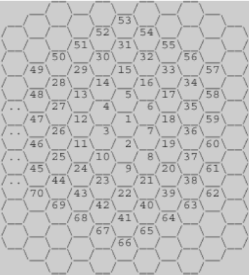
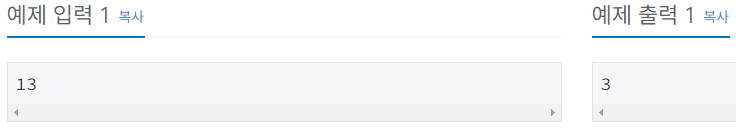
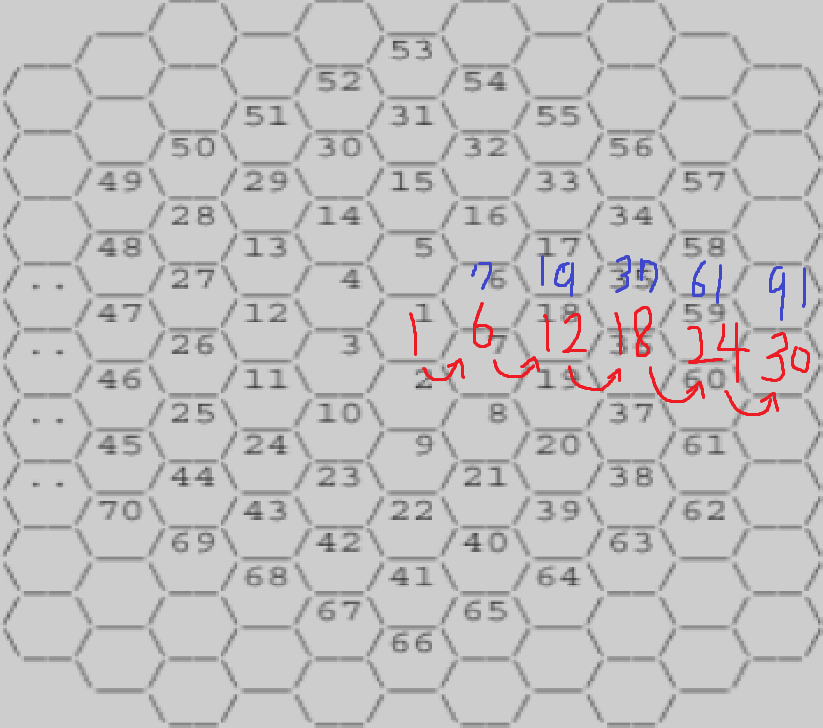

# Bronze-2 2292번

### 문제

<p>위의 그림과 같이 육각형으로 이루어진 벌집이 있다. 그림에서 보는 바와 같이 중앙의 방 1부터 시작해서 이웃하는 방에 돌아가면서 1씩 증가하는 번호를 주소로 매길 수 있다. 숫자 N이 주어졌을 때, 벌집의 중앙 1에서 N번 방까지 최소 개수의 방을 지나서 갈 때 몇 개의 방을 지나가는지(시작과 끝을 포함하여)를 계산하는 프로그램을 작성하시오. 예를 들면, 13까지는 3개, 58까지는 5개를 지난다.</p>

### 입력
<p>첫째 줄에 N(1 ≤ N ≤ 1,000,000,000)이 주어진다.</p>

### 출력
<p>입력으로 주어진 방까지 최소 개수의 방을 지나서 갈 때 몇 개의 방을 지나는지 출력한다.</p>

### 예제


### 내 풀이
```python
import sys
input = sys.stdin.readline

N = int(input())

sum = 1
i = 1
while True:
    if N <= sum:
        print(i)
        break
    sum += 6*i
    i += 1
```

문제풀이를 위해서 규칙을 찾을 필요가 있었다.


벌집 중앙으로부터 돌아가면서 증가하는 형태인데, 껍질마다 방의 개수를 세어보니, 6의 배수만큼 커진다는 것을 발견하였다.

따라서 초기값이 1인 sum이라는 변수에 반복이 한번 될 때마다 6*i를 더하면서 N과 비교하여, 몇 개의 방을 지나야하는지 출력하였다.

### 다른사람 풀이
```python
import sys
input = sys.stdin.readline

n = int(input())
num = 1
cnt = 1
while n > num:
    num += 6*cnt
    cnt += 1
print(cnt) 
```

나랑 같은 방식으로 풀이를 하였는데, if문을 따로 사용하지 않고, while문의 조건식으로 넣어서 더 짧은 코드가 되었다.