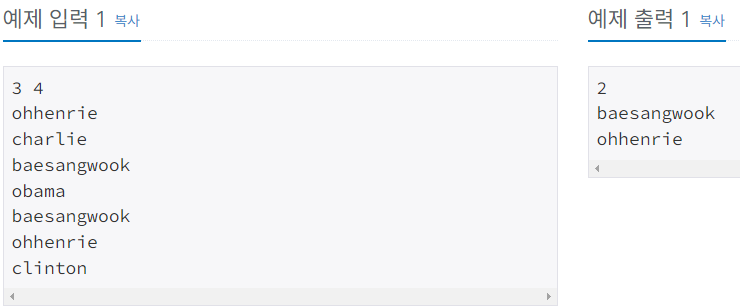

# Silver-4 1764번

### 문제
<p>김진영이 듣도 못한 사람의 명단과, 보도 못한 사람의 명단이 주어질 때, 듣도 보도 못한 사람의 명단을 구하는 프로그램을 작성하시오.</p>

### 입력
<p>첫째 줄에 듣도 못한 사람의 수 N, 보도 못한 사람의 수 M이 주어진다. 이어서 둘째 줄부터 N개의 줄에 걸쳐 듣도 못한 사람의 이름과, N+2째 줄부터 보도 못한 사람의 이름이 순서대로 주어진다. 이름은 띄어쓰기 없이 알파벳 소문자로만 이루어지며, 그 길이는 20 이하이다. N, M은 500,000 이하의 자연수이다.

듣도 못한 사람의 명단에는 중복되는 이름이 없으며, 보도 못한 사람의 명단도 마찬가지이다.</p>

### 출력
<p>듣보잡의 수와 그 명단을 사전순으로 출력한다.</p>

### 예제


### 내 첫 번째 풀이
```python
import sys

input = sys.stdin.readline

N, M = map(int, input().split())
name = []
result = []

for i in range(N):
    name.append(input().strip())
for i in range(M):
    Q_input = input().strip()
    if Q_input in name:
        result.append(Q_input)

result.sort()
print(len(result))
for i in result:
    print(i)
```

처음에는 듣도 못한 사람들의 이름을 먼저 리스트에 담아두고, 보도 못한 사람들의 이름을 받아올 때, 듣도 못한 사람들 리스트에 있는 이름인지 확인하여 새로운 배열에 담아두면 될 것이라고 생각하고 풀이 하였다.


하지만 결과는 시간초과..

보도 못한 사람들의 이름을 입력할 때, 비교하는 과정이 오래 걸리는 듯 하다.

### 내 두 번째 풀이
```python
import sys

input = sys.stdin.readline

N, M = map(int, input().split())
names = dict()
result = []

for i in range(N):
    name = input().strip()
    names[name] = i

for i in range(M):
    Q_input = input().strip()
    if Q_input in names:
        result.append(Q_input)

result.sort()
print(len(result))
for i in result:
    print(i)
```

해시 테이블을 사용하면 시간을 크게 단축시킬 수 있다는 말을 듣고, 파이썬에서 해시 테이블과 같은 역할을 하는 dictionary를 사용하여 풀이하였다. 

dictionary에서 탐색 연산(in 연산자)는 시간복잡도 O(1)를 자랑하므로, 듣도 못한 사람들의 이름들을 key로 하여 dictionary에 저장해주었다.

이후에, 보도 못한 사람들의 이름을 입력받아서, names 딕셔너리에 in 연산자로 존재하는지 판단하고, 존재하면 result 리스트에 저장해주었다.

result 리스트를 sort()로 정렬해주고 출력!


시간초과 없이 정답!