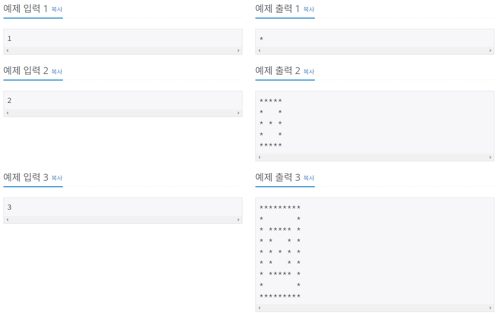
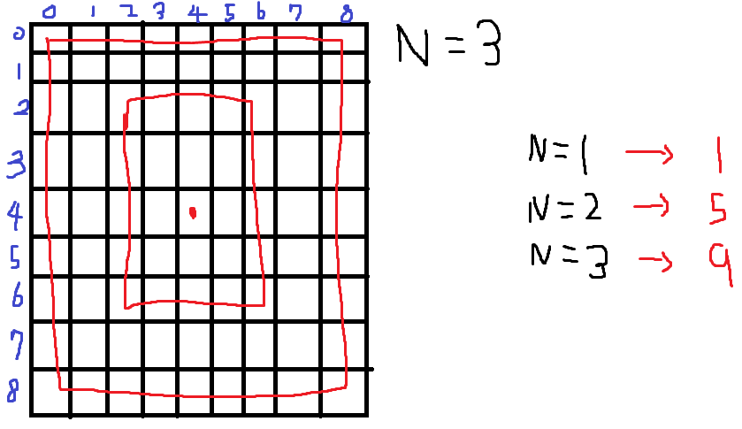

# Silver-4 10994번

### 문제
<p>예제를 보고 규칙을 유추한 뒤에 별을 찍어 보세요.</p>

### 입력
<p>첫째 줄에 N(1 ≤ N ≤ 100)이 주어진다.</p>

### 출력
<p>첫째 줄부터 차례대로 별을 출력한다.</p>

### 예제


### 내 풀이
```python
import sys
input = sys.stdin.readline

N = int(input())
length = 4*N-3
star_array = [[' ']*(length) for _ in range(length)]

def star(n,x,y):
    global star_array

    length = 4*n-3
    if length == 1:
        star_array[x][y] = '*'
        return
    for i in range(length):
        star_array[x][y+i] = '*'
        star_array[x+i][y] = '*'
        star_array[x+(length-1)][y+i] = '*'
        star_array[x+i][y+(length-1)] = '*'
    n -= 1
    x += 2
    y += 2
    star(n,x,y)
    return

star(N,0,0)
for i in range(length):
    print(*star_array[i], sep='')
```

손을 못대겠어서 풀이를 먼저 보고, 이해하는 것에 집중하였다.



패턴을 분석하고, 재귀를 이용해 풀이하는 것에 익숙해져야 할 것 같다.